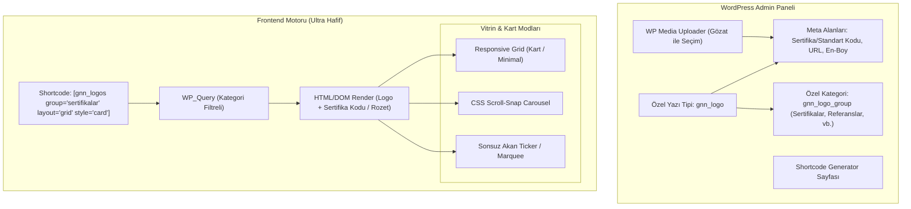

# Implementation Plan - WordPress Logo & Sertifika Vitrini (GNN Logos)

Referanslar, çözüm ortakları, sertifikalar ve sponsorlar gibi logoları WordPress sitelerinde kolayca yönetmek; en-boy oranı (aspect ratio) korumalı, harici ağır kütüphaneler içermeyen, yüksek performanslı ve modern animasyonlu (Grid, Carousel, Sonsuz Kayan Ticker) bir vitrin eklentisi geliştirme planıdır.

---

## 1. Goal Description

WordPress kullanıcılarının harici sayfa oluşturuculara veya ağır JavaScript kütüphanelerine muhtaç kalmadan, referans/çözüm ortağı logolarının yanı sıra **TS EN 12201-2, TS EN ISO 1452-2** gibi sertifika ve standart kodlarını şık kart tasarımlarıyla listeleyebilmesi ve `[gnn_logos]` shortcode'u ile diledikleri sayfaya ekleyebilmesi hedeflenmektedir.

### Temel Prensipler:
- **Ultra Hafif (Zero Dependency):** Frontend'de harici kütüphane (jQuery slider, Swiper vb.) **kullanılmaz**. Saf CSS (CSS Scroll-Snap & GPU-hızlandırmalı Keyframe Marquee) ve 3 KB'tan küçük mikro Vanilla JS kullanılır.
- **Sertifika & Başlık Alanı Tasarımı:** Sertifikalar için görselin altına şık, modern tipografiye sahip rozet/kart (badge/card) tarzında standart kodu ve başlık ekleme desteği.
- **En-Boy Oranı & Çözünürlük Bütünlüğü:** Farklı ebatlardaki logoların bozulmasını önlemek için modern CSS `aspect-ratio` ve `object-fit: contain` desteği.
- **Grup / Kategori Desteği:** "Referanslar", "Çözüm Ortakları", "Sertifikalar", "Markalar" gibi bağımsız gruplar.
- **Animasyon ve Vitrin Modları:**
  1. **Carousel / Slider:** Sağa-sola kayan, dokunmatik (touch/swipe) destekli, otomatik oynatmalı ve ok/nokta navigasyonlu kaydırıcı.
  2. **Continuous Ticker / Marquee:** Kesintisiz, pürüzsüz sağa veya sola sonsuz akan logo şeridi.
  3. **Responsive Grid:** Çok sütunlu, modern kart veya şeffaf ızgara düzeni.
- **WP Media Uploader Entegrasyonu:** WordPress yerel ortam kütüphanesinden ("Gözat") tek tıkla logo seçimi.

---

## 2. User Review Required

> [!IMPORTANT]
> **Sertifika & Başlık Görsel Tasarımı:**
> Sertifikalar gösterilirken iki farklı şık stil seçeneği sunulacaktır:
> 1. **Modern Kart (Card / Boxed):** Hafif gölgeli veya ince border'lı beyaz kart kutusu, üstte ortalanmış sertifika logosu/mührü, altta şık rozet (badge/pill) veya net tipografiyle standart kodu (Örn: `TS EN 12201-2`).
> 2. **Minimal / Şeffaf (Clean Minimal):** Arka plansız, logonun hemen altında zarif gri-koyu renkli standart metni.

> [!TIP]
> **Performans:** Sertifika başlıkları ve logolar CSS Grid ve Flexbox ile oluşturulur; DOM derinliği minimumda tutulur.

---

## 3. Open Questions

1. **Sertifika Kartı Tıklanabilirliği (Pop-up/PDF Desteği):** Sertifikalara tıklandığında ilgili belgenin PDF'ine gitmesi veya sertifika görselinin büyük halinin (Lightweight Lightbox ile) açılması gibi bir özellik ister misiniz?
2. **Kart Çerçevesi (Border/Shadow):** Sertifika görünümünde varsayılan olarak hafif gri çerçeve (`border: 1px solid #e2e8f0`) ve hafif yuvarlatılmış köşeler (`border-radius: 8px`) tercih eder misiniz?

---

## 4. Architecture & Data Flow



---

## 5. Proposed Changes & File Structure

```
c:\Users\bigde\.antigravity\gnn-logos\
├── gnn-logos.php                     # Ana eklenti dosyası (Init, Hook'lar, Assets kaydı)
├── README.md                          # Kurulum, sertifika örnekleri ve shortcode kılavuzu
├── includes/
│   ├── class-gnn-logos-cpt.php        # CPT, Kategori ve Sertifika Kodu Meta Alanları
│   ├── class-gnn-logos-shortcode.php  # [gnn_logos] render motoru (Başlık/Rozet destekli)
│   └── class-gnn-logos-admin.php      # Admin menüsü ve etkileşimli Shortcode Sihirbazı
└── assets/
    ├── css/
    │   ├── gnn-logos-frontend.css     # Kart tasarımları, sertifika rozetleri, carousel & marquee CSS
    │   └── gnn-logos-admin.css        # Admin arayüzü ve önizleme stilleri
    └── js/
        ├── gnn-logos-frontend.js      # Ultra hafif Vanilla JS kontrolcüsü (<3KB)
        └── gnn-logos-admin.js         # Media kütüphanesi açma ve seçim betiği
```

---

### Detailed Component Specifications

#### [NEW] `includes/class-gnn-logos-cpt.php`
- **CPT:** `gnn_logo` (Logo / Sertifika Vitrini).
- **Taxonomy:** `gnn_logo_group` ("Sertifikalar", "Referanslar", "Çözüm Ortakları").
- **Meta Box Alanları:**
  - **Logo / Sertifika Görseli:** "Gözat" butonu ile Media Library'den seçim, görsel önizleme ve silme.
  - **Sertifika Kodu / Alt Başlık (`_gnn_subtitle`):** Örn: `TS EN 12201-2`, `TS EN ISO 1452-2`, `TS EN 1555-2`.
  - **Ek Açıklama / Kurum Adı (`_gnn_description`):** Opsiyonel küçük açıklama (Örn: "TSE Onaylı Kalite Standardı").
  - **Hedef URL (`_gnn_link_url`):** Opsiyonel belge/web adresi.
  - **Hedef Açılış Biçimi (`_gnn_link_target`):** `_self` veya `_blank`.
  - **Özel En-Boy Oranı:** `auto`, `16:9`, `4:3`, `1:1`, `3:2`.

#### [NEW] `includes/class-gnn-logos-shortcode.php`
`[gnn_logos]` Shortcode'u için genişletilmiş parametreler:
- `group`: Kategori slug'ı (`sertifikalar`, `referanslar` veya `all`).
- `layout`: `grid` | `carousel` | `marquee` (Varsayılan: `carousel`).
- `style`: `card` | `bordered` | `minimal` (Sertifikalar için özel kart kutusu).
- `show_title`: `true` | `false` (Ana başlığı göster/gizle).
- `show_code`: `true` | `false` (Sertifika/standart kodunu rozet/metin olarak göster).
- `aspect_ratio`: `1/1` (Kare), `4/3` (Sertifikalara uygun), `16/9`, `auto`.
- `columns`: Masaüstü sütun adedi (Örn: `4`).
- `columns_tablet`: Tablet sütun adedi (Örn: `3`).
- `columns_mobile`: Mobil sütun adedi (Örn: `2`).
- `grayscale`: `true` | `false` (Fareyle üzerine gelince renklenme efekti).
- `autoplay`: `true` | `false`.
- `speed`: Marquee hızı veya carousel geçiş süresi.

#### [NEW] `assets/css/gnn-logos-frontend.css` (Sertifika Stilleri Dahil)
- **Sertifika Kartı ve Rozet Tasarımı:**
  ```css
  /* Sertifika Kart Kapsayıcısı */
  .gnn-logo-card {
      background: #ffffff;
      border: 1px solid #e2e8f0;
      border-radius: 10px;
      padding: 16px;
      display: flex;
      flex-direction: column;
      align-items: center;
      justify-content: space-between;
      transition: transform 0.2s ease, box-shadow 0.2s ease;
      box-shadow: 0 1px 3px rgba(0, 0, 0, 0.05);
  }
  .gnn-logo-card:hover {
      transform: translateY(-3px);
      box-shadow: 0 10px 15px -3px rgba(0, 0, 0, 0.08);
      border-color: #cbd5e1;
  }

  /* Sertifika Görsel Alanı */
  .gnn-logo-card .gnn-logo-item-inner {
      width: 100%;
      display: flex;
      align-items: center;
      justify-content: center;
  }

  /* Sertifika Kodu / Rozeti (TS EN 12201-2 vb.) */
  .gnn-cert-code {
      display: inline-block;
      margin-top: 12px;
      padding: 4px 10px;
      background: #f1f5f9;
      color: #0f172a;
      font-size: 13px;
      font-weight: 600;
      letter-spacing: 0.5px;
      text-transform: uppercase;
      border-radius: 6px;
      border: 1px solid #e2e8f0;
      text-align: center;
  }

  /* Opsiyonel Sertifika Açıklaması */
  .gnn-cert-desc {
      font-size: 12px;
      color: #64748b;
      margin-top: 4px;
      text-align: center;
  }
  ```

#### [NEW] `includes/class-gnn-logos-admin.php` & `assets/js/gnn-logos-admin.js`
- Gözat butonu ile WordPress Ortam Kütüphanesi entegrasyonu.
- Logo/Sertifika düzenleme ekranında "Sertifika Kodu / Standart" alanı.
- Etkileşimli Shortcode Sihirbazında **"Sertifika Kart Görünümü"** şablon seçeneği.

---

## 6. Verification Plan

### Manual Verification Steps
1. **Sertifika Veri Girişi:**
   - WP Admin > Logo Vitrini > Yeni Ekle sayfasına gidilecek.
   - Logo/Sertifika belgesi görseli yüklenecek.
   - Başlığa "TS EN 12201-2 Belgesi", Sertifika Kodu alanına `TS EN 12201-2` yazılacak.
   - Kategori olarak "Sertifikalar" seçilip kaydedilecek.
2. **Sertifika Kart Görünümü Testi:**
   - Bir sayfaya `[gnn_logos group="sertifikalar" layout="grid" style="card" show_code="true" columns="3" aspect_ratio="4/3"]` shortcode'u eklenecek.
   - Logoların şık bir kart içinde ortalandığı, altında gri/mavi tonlu şık bir rozet içinde `TS EN 12201-2`, `TS EN ISO 1452-2` yazılarının estetik göründüğü kontrol edilecek.
3. **Sertifikalar için Carousel & Marquee Testi:**
   - `[gnn_logos group="sertifikalar" layout="carousel" style="card" show_code="true"]` ile sertifikaların yatayda şık bir şekilde kaydığı doğrulanacak.
4. **Hafiflik & Responsive Test:**
   - Kartların mobil ekranda 1 veya 2 sütuna düzgünce düştüğü, taşma olmadığı kontrol edilecek.
