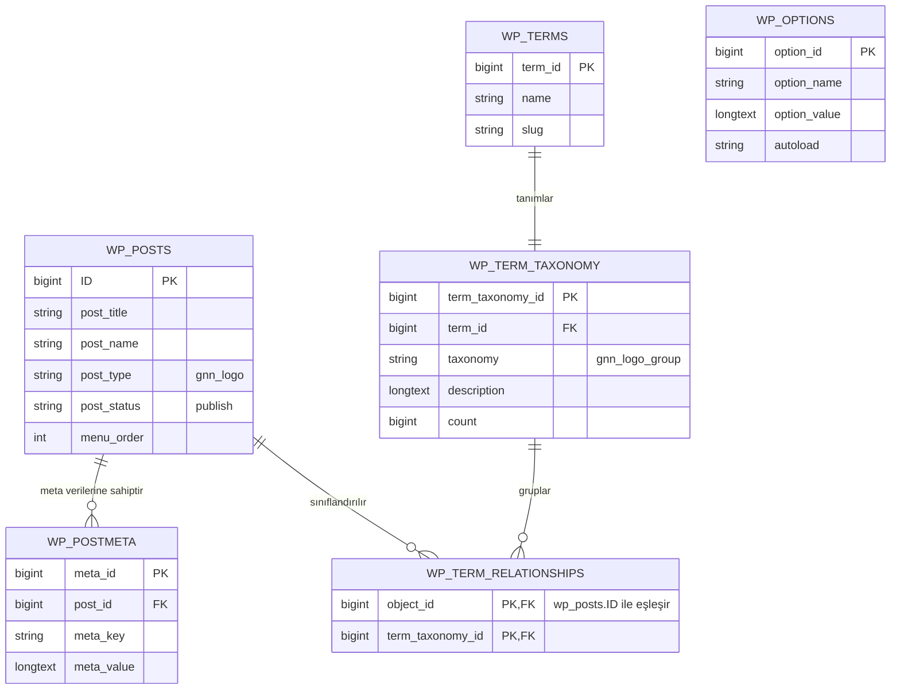

# Veri Sözlüğü ve Kalıcılık Belirtimi

<!-- Verified from: gnn-logos/includes/class-gnn-logos-cpt.php#L20-L80 -->
<!-- Verified from: gnn-logos/includes/class-gnn-logos-cpt.php#L300-L355 -->
<!-- Verified from: gnn-logos/inc/updater.php#L35-L45 -->
<!-- Verified from: gnn-logos/uninstall.php#L1-L44 -->

## 1. Varlık İlişkileri Genel Bakışı (ER Şeması)

GNN Logos, harici özel SQL tabloları oluşturmadan tamamen WordPress çekirdek ilişkisel tablolarını kullanır:

---

## 2. Temel Varlık Belirtimleri

### 2.1 Özel Yazı Türü (CPT): `gnn_logo`
- **Kayıt Dosyası:** `gnn-logos/includes/class-gnn-logos-cpt.php#L20-L50`
- **Depolama Tablosu:** `wp_posts`
- **Filtrelenen Alanlar:**
  - `post_type`: Kesin olarak `'gnn_logo'`
  - `post_status`: `'publish'`, `'draft'`, `'trash'`
  - `post_title`: Logo / Firma Adı olarak kullanılır ve görsel `alt` metni için yedektir.
  - `menu_order`: `orderby="menu_order"` varsayılan sıralamasında kullanılır.

### 2.2 Taksonomi: `gnn_logo_group`
- **Kayıt Dosyası:** `gnn-logos/includes/class-gnn-logos-cpt.php#L55-L85`
- **Depolama Tabloları:** `wp_terms`, `wp_term_taxonomy`, `wp_term_relationships`
- **Tür:** Hiyerarşik (kategori yapısında)
- **Amaç:** Logoları mantıksal vitrin gruplarına ayırır (örn: `sertifikalar`, `referanslar`, `cozum-ortaklari`).

---

## 3. İkincil Nitelikler ve Postmeta Anahtarları

<!-- Verified from: gnn-logos/includes/class-gnn-logos-cpt.php#L300-L355 -->

Tüm özel nitelikler WordPress standart `get_post_meta()` ve `update_post_meta()` API'leri üzerinden `wp_postmeta` tablosunda saklanır:

| Meta Anahtarı (`meta_key`) | Veri Türü | Serileştirme | Sanitizasyon Fonksiyonu | Amaç ve Varsayılan Değer |
|---|---|---|---|---|
| `_gnn_logo_id` | Tamsayı (`bigint`) | Ham Skaler | `absint($_POST['gnn_logo_id'])` | `wp_posts` tablosundaki eke işaret eden WordPress ortam ID'si (`post_type = 'attachment'`). |
| `_gnn_cert_codes` | String Dizisi | PHP Serialized Array | `sanitize_text_field(wp_unslash($raw_code))` | Çoklu standart etiket dizisi (örn: `['TS EN 12201-2', 'TS EN ISO 1452-2']`). Ayrı rozet hapları olarak basılır. |
| `_gnn_cert_code` | Metin (`varchar`) | Virgülle ayrılmış string | `sanitize_textarea_field(wp_unslash($_POST['gnn_cert_code']))` | Geriye dönük uyumluluk için korunan tekli standart metni. |
| `_gnn_description` | Metin (`text`) | Ham String | `sanitize_text_field(wp_unslash($_POST['gnn_description']))` | Başlığın altında gösterilen alt açıklama veya akreditasyon kurumu metni. |
| `_gnn_link_url` | Web Adresi (`url`) | Ham String | `esc_url_raw(wp_unslash($_POST['gnn_link_url']))` | Logoya tıklandığında gidilecek hedef yönlendirme bağlantısı. |
| `_gnn_link_target` | Seçim (`enum`) | Ham String | `in_array(..., ['_self', '_blank'])` | Bağlantının açılma hedefi (`_blank` yeni sekme, `_self` aynı sekme). Varsayılan: `'_blank'`. |
| `_gnn_aspect_ratio` | Seçim (`enum`) | Ham String | `in_array(..., ['auto', '16:9', '4:3', '1:1', '3:2', '2:1'])` | Öğeye özel en-boy oranı geçersiz kılma ayarı. Varsayılan: `'auto'`. |

---

## 4. Önbellekleme ve Transient Sözlüğü

<!-- Verified from: gnn-logos/inc/updater.php#L35-L45 -->
<!-- Verified from: gnn-logos/inc/updater.php#L156 -->
<!-- Verified from: gnn-logos/uninstall.php#L37-L43 -->

Eklenti, dış ağ isteklerini ve güncelleme bildirimlerini WordPress Transients API (`wp_options` tablosu) üzerinden yönetir:

| Transient Anahtarı | Depolama Yeri | Yaşam Süresi (TTL) | Temizleme / Geçersiz Kılma Tetikleyicisi | Saklanan Veri Yapısı |
|---|---|---|---|---|
| `gnn_logos_github_update_check` | `wp_options` (`_transient_...`) | `43200` saniye (12 saat) | `update-core.php` ziyareti, manuel güncelleme kontrolü veya eklenti kaldırma (`uninstall.php`) | `(object) ['version' => '1.2.0', 'download_url' => '...', 'changelog' => '...', 'published_at' => '...']` |
| `_site_transient_update_plugins` | `wp_options` (WP Çekirdeği) | WP Çekirdeği Yönetir (12 saat) | Güncelleme sonrası kurulum, çekirdek kontrolü veya manuel istek | `$transient->response['gnn-logos/gnn-logos.php']` içine standart güncelleme nesnesi ekler |

---

## 5. Fiziksel Depolama Varlıkları

<!-- Verified from: gnn-logos/includes/class-gnn-logos-cpt.php#L190-L240 -->

| Varlık Türü | Depolama Konumu | Erişim Protokolü | Yönetim Arayüzü |
|---|---|---|---|
| **Logo Görselleri** | `/wp-content/uploads/YYYY/MM/` | Standart WordPress Ek URL'leri | "Gözat / Logo Seç" butonu ile WordPress Ortam Kütüphanesi modalı (`wp.media`) |
| **Eklenti Paketi** | `/wp-content/plugins/gnn-logos/` | Yerel Sunucu Dosya Sistemi | WordPress Eklentiler Sayfası / Git |
| **Sürüm Paketi Arşivi** | `gnn-logos-1.2.0.zip` | GitHub Releases CDN | GitHub Actions Yayınlama Hattı (`.github/workflows/release.yml`) |
